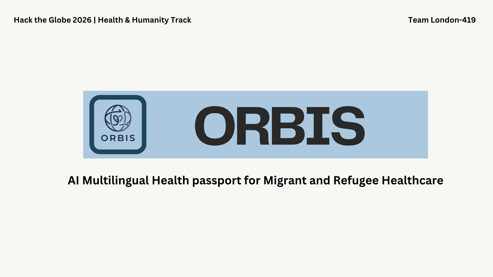
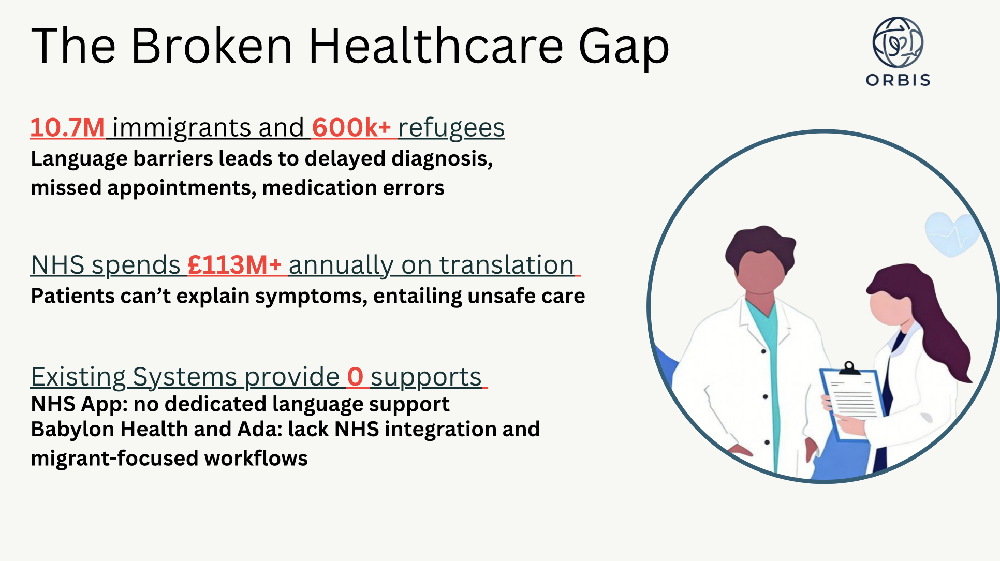
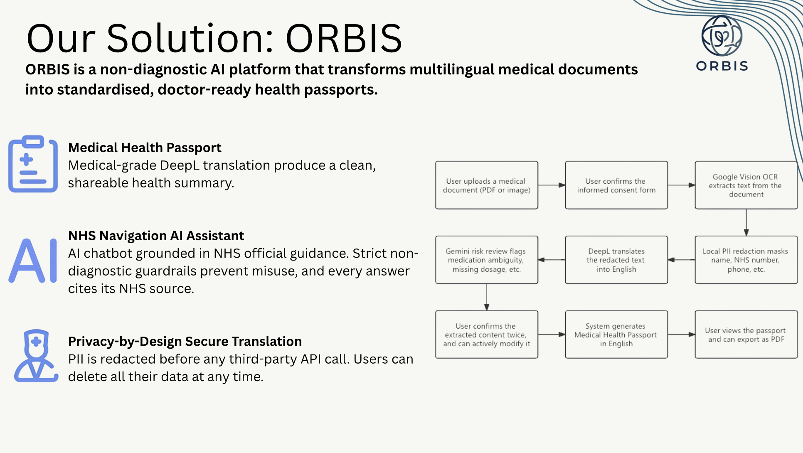
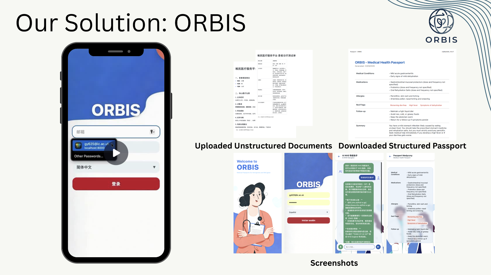

# ORBIS - The medical passport for refugees

*A Hack the Globe Project*



AI-powered healthcare navigation platform that helps refugees and migrants access NHS services in their own language.
It bridges the gap between non-English-speaking patients and the UK healthcare system through verified multilingual support, structured health data, and guided NHS navigation.
Language barriers can cost lives; being in the business of saving and improving lives,
it's time that the NHS spoke every language, catered to all needs, and left no patient behind.



## Contents

This repository is our demo application.
For quick prototyping, we chose Python for a web app first.
In production, however, we expect to deliver the project as a mobile app for convenience.

We used `FastAPI` to implement the API of the server, including general user API and our actual business logic.
The web app has 2 major functions:

### Navigator

This serves as the guide for refugees when they encounter something they don't understand.
Supports voice input via the *Web Speech API*.

The navigator has 3 endpoints:
- `/ask`: Allows the user to ask general questions about NHS.
    To achieve this, we included general facts about the NHS in `services/knowledge_base.py`, that are fed to the AI agent.
    We also want to ensure the agent doesn't do anything unsafe, so we introduced several protection mechanisms.

    In `REFUSED_PATTERNS` (`services/navigator.py line 18`), we defined several keywords that should be rejected by the agent when asked.
    We also carefully refined our prompt for this purpose.

- `/explain`: Summarises an NHS document to the user.
    In order to summarise the document, we first do OCR on the document via selected model (`services/ocr.py`).

- `/help`: If the user needs more help.

### Passport

This holds information about the user based on their conversation and document uploaded in the system.
An AI agent is used to summarise all the information into a *structured* JSON object.
The information is stored in `PostgreSQL` database via `Supabase`, a cloud database provider.
For **privacy** purpose, PII is redacted before being sent to any third-party service.

We provide general RESTful API for getting, updating and deleting a *Passport*.
When the user edits their *Passport*, we use an AI agent to help ensure that valid information is supplied.
There's also an endpoint about evaluating risk.

### Translation

This app will be accessible from any language, delivered to who needs it the most.
We use the `DeepL` API for translation.

In the database we have a `preferred_language` field (`scripts/db_setup.sql line 7`) that reflects the user's selected language.
After that anything relevant will be presented to the user by the user's selected language.

We want to ensure the integrity of the translation, since mistakes in medical realm can be very expensive.
To minimise the risk, we used a "peer review" model.
Every translation produced will then be *reviewed* by another AI agent to determine its validity.
In the process we also ask the "reviewer" to look for any errors and safety concerns that might hasn't been discovered.

### Web App

Our demo web app is done via Jinja2 templates.
For now, it is served alongside by the server.

In production, we expect it to become a separate client that access the service worldwide.

### Privacy

Before any document text is sent to external AI or translation services, we run a local PII redaction pass (`services/pii_redact.py`).
This masks identifiable fields — NHS numbers, phone numbers, dates, names, postcodes, and email addresses —
while preserving all clinical content (conditions, medications, allergies).
The original OCR text is retained for the user's own record, but only the redacted version ever leaves our system.

Before a document is processed, users are shown a consent modal explaining:
```
Their document will be processed by AI services (Google Vision, DeepL, Gemini).
AI results may not be fully accurate and require user review.
Data is used solely to generate their health passport and is not shared with third parties.
They can delete all their data at any time from the account settings.
```

Users can delete all their data (documents, passport, translations, risk checks) at any time from the account management page.
This triggers a full cascade delete across all related database tables, leaving no residual records.





## Usage

Before using, please fill all relevant API keys in `.env`.
An example for this is available in `.env.example`.

The demo is available at `http://localhost:8000` after running `uvicorn main:app`.

## Demo Video

https://vimeo.com/1175911385
